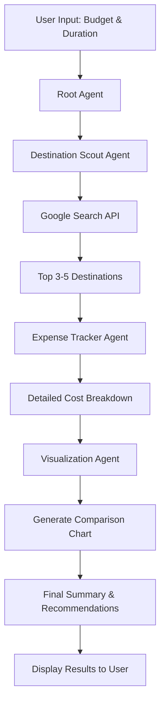

<div align="center">

# 🌍 AI Travel Planner Agent

### *Intelligent Multi-Agent System for Smart Travel Planning*

[](https://www.python.org/downloads/)
[](https://ai.google.dev/)
[](LICENSE)
[]()

*Powered by Google's AI Development Kit (ADK) and Gemini 2.5*

[Features](#-features) • [Architecture](#-architecture) • [Installation](#-installation) • [Usage](#-usage) • [Documentation](#-documentation)

</div>

---

## 📖 About The Project

**AI Travel Planner Agent** is an intelligent, multi-agent orchestration system that leverages Google's cutting-edge Gemini AI to help you plan the perfect trip. Unlike simple chatbots, this system employs a **hierarchical agent architecture** where specialized AI agents collaborate to:

🔍 **Scout Destinations** - Discover travel options matching your budget and preferences  
💰 **Track Expenses** - Generate detailed cost breakdowns for flights, hotels, food, and activities  
📊 **Visualize Data** - Create beautiful charts comparing your options  
💾 **Persist Sessions** - Remember your conversations across sessions using SQLite  

### Why This Project?

- **Multi-Agent Architecture**: Experience the future of AI with coordinated specialist agents
- **Real-Time Search**: Integrates Google Search for up-to-date travel information
- **Budget-Conscious**: Get realistic cost estimates before you book
- **Visual Insights**: Compare destinations at a glance with auto-generated charts
- **Session Memory**: Your conversation history is preserved across sessions

---

## ✨ Features

### 🤖 **Hierarchical Agent System**

```
┌─────────────────────────────────────────────────────┐
│              Root Agent (Orchestrator)              │
└─────────────────────────────────────────────────────┘
                         │
        ┌────────────────┼────────────────┐
        │                │                │
        ▼                ▼                ▼
┌───────────────┐ ┌──────────────┐ ┌──────────────────┐
│  Destination  │ │   Expense    │ │  Visualization   │
│ Scout Agent   │ │Tracker Agent │ │     Agent        │
├───────────────┤ ├──────────────┤ ├──────────────────┤
│ • Find deals  │ │ • Breakdown  │ │ • Summarize      │
│ • Match budget│ │   costs      │ │ • Generate       │
│ • Top 3-5     │ │ • Calculate  │ │   charts         │
│   options     │ │   totals     │ │ • Compare        │
└───────────────┘ └──────────────┘ └──────────────────┘
```

### 🛠️ **Core Capabilities**

| Feature | Description |
|---------|-------------|
| **🌐 Google Search Integration** | Real-time web search for current travel deals and information |
| **💳 Expense Breakdown** | Detailed cost analysis: flights, accommodation, food, activities |
| **📈 Data Visualization** | Matplotlib-powered charts for cost comparison |
| **💾 Database Persistence** | SQLite-backed session storage for conversation history |
| **⚡ Async Operations** | High-performance async/await architecture |
| **🎯 Sequential Processing** | Coordinated multi-step agent workflows |

---

## 🏗️ Architecture

### Project Structure

```
task_planner_agent/
├── 📄 main.py                    # Application entry point
├── 📋 requirements.txt           # Python dependencies
├── 🗄️ my_agent_data.db          # SQLite session database
├── 📁 src/                       # Source code
│   ├── __init__.py
│   ├── 🤖 agents.py              # Multi-agent system definitions
│   ├── ⚙️ config.py              # Configuration & secrets management
│   ├── 📊 models.py              # Pydantic data models
│   └── 🛠️ tools/                 # Agent tools & capabilities
│       ├── __init__.py
│       └── visualization.py      # Chart generation tools
└── 📖 README.md                  # This file
```

### Agent Workflow



### Technology Stack

- **AI Framework**: Google AI Development Kit (ADK)
- **LLM Model**: Gemini 2.5 Flash Lite
- **Language**: Python 3.9+
- **Database**: SQLite (via SQLAlchemy)
- **Visualization**: Matplotlib
- **Environment**: python-dotenv
- **Data Validation**: Pydantic

---

## 🚀 Installation

### Prerequisites

- Python 3.9 or higher
- Google API Key ([Get one here](https://aistudio.google.com/))
- pip package manager

### Step-by-Step Setup

1. **Clone the Repository**

```bash
git clone <your-repo-url>
cd task_planner_agent
```

2. **Create Virtual Environment** (Recommended)

```bash
# Windows
python -m venv venv
.\venv\Scripts\activate

# macOS/Linux
python3 -m venv venv
source venv/bin/activate
```

3. **Install Dependencies**

```bash
pip install -r requirements.txt
```

4. **Configure Environment Variables**

Create a `.env` file in the project root:

```bash
GOOGLE_API_KEY=your_google_api_key_here
```

> 🔑 **Get Your API Key**: Visit [Google AI Studio](https://aistudio.google.com/) to obtain a free API key

---

## 💻 Usage

### Basic Usage

Start the travel planner agent:

```bash
python main.py
```

### Example Interaction

```
Initializing Travel Planner Agent...
[Success] Gemini API key setup complete.

Enter your travel goal (or type 'quit' to exit): I want to travel for 7 days with a budget of $2000

--- Starting Task ---

🔍 Destination Scout Agent:
   Searching for destinations within your budget...
   
   Found 3 great options:
   1. Bali, Indonesia - Tropical paradise with temples
   2. Prague, Czech Republic - Historic European charm
   3. Bangkok, Thailand - Vibrant city with amazing food

💰 Expense Tracker Agent:
   Calculating detailed costs...
   
   Bali, Indonesia:
   • Flights: $600
   • Accommodation (7 nights): $350
   • Food & Dining: $280
   • Activities: $200
   • Miscellaneous: $100
   Total: $1,530

   [Similar breakdowns for other destinations...]

📊 Visualization Agent:
   Generating comparison chart...
   [Bar chart displayed]
   
   Summary: Bali offers the best value with diverse activities under budget,
   while Prague provides a rich cultural experience at a similar price point.

--- Task Completed ---

Do you want to plan another trip? (y/n):
```

### Advanced Options

- **Session Persistence**: Your conversations are automatically saved to `my_agent_data.db`
- **Cost Visualization**: Charts are generated using matplotlib and displayed automatically
- **Continuous Planning**: Plan multiple trips in one session

---

## 📊 Example Output

### Expense Breakdown

```json
[
  {
    "location": "Bali, Indonesia",
    "breakdown": {
      "flights": 600,
      "accommodation": 350,
      "food": 280,
      "activities": 200,
      "miscellaneous": 100
    },
    "total_price": 1530
  }
]
```

### Visualization

The agent automatically generates a comparison bar chart:

```
Total Cost Comparison
│
│     ████
│     ████  ████
│     ████  ████  ████
│     ████  ████  ████
└─────────────────────
     Bali  Prague Bangkok
    $1530  $1750  $1680
```

---

## 🔧 Configuration

### Agent Customization

Edit `src/agents.py` to customize agent behavior:

- **Models**: Change `model="gemini-2.5-flash-lite"` to other Gemini variants
- **Instructions**: Modify agent prompts for different behaviors
- **Tools**: Add more tools to the `tools=[]` parameter
- **Output Keys**: Customize data flow between agents

### Adding New Tools

Create new tools in `src/tools/`:

```python
def your_custom_tool(param1: str, param2: int) -> str:
    """
    Your tool description here.
    
    Args:
        param1: Description
        param2: Description
        
    Returns:
        str: Result description
    """
    # Your implementation
    return "result"
```

---

## 🎯 Roadmap

- [ ] Add support for multi-city trips
- [ ] Integration with flight booking APIs
- [ ] Hotel recommendation system
- [ ] Weather forecast integration
- [ ] Currency conversion tool
- [ ] User preference learning
- [ ] Export itineraries to PDF
- [ ] Mobile app interface
- [ ] Real-time price monitoring

---

## 🤝 Contributing

Contributions are welcome! Here's how you can help:

1. Fork the repository
2. Create a feature branch (`git checkout -b feature/AmazingFeature`)
3. Commit your changes (`git commit -m 'Add some AmazingFeature'`)
4. Push to the branch (`git push origin feature/AmazingFeature`)
5. Open a Pull Request

---

## 📝 License

Distributed under the MIT License. See `LICENSE` for more information.

---

## 🙏 Acknowledgments

- **Google AI** for the amazing Gemini API and ADK
- **Python Community** for excellent libraries
- All contributors and users of this project

---

## 📧 Contact

For questions, suggestions, or collaboration:

- Create an issue in this repository
- Reach out via GitHub Discussions

---

<div align="center">

### ⭐ Star this repo if you find it helpful!

**Built with ❤️ using Google Gemini AI**

</div>